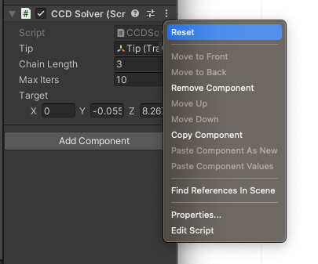

A simple Unity Cyclic Coordinate Descent Inverse Kinematics solver. For 15-464.

<!-- USAGE EXAMPLES -->
## Usage

To get the solver running, open the Unity project. Then open the CCD_IK scene. Then expand the entire hierarchy. You need to click Reset on the CCDSolver component for each Tip object to initialize the solver. After that you should be able to drag the target around the scene and the limb should follow.

